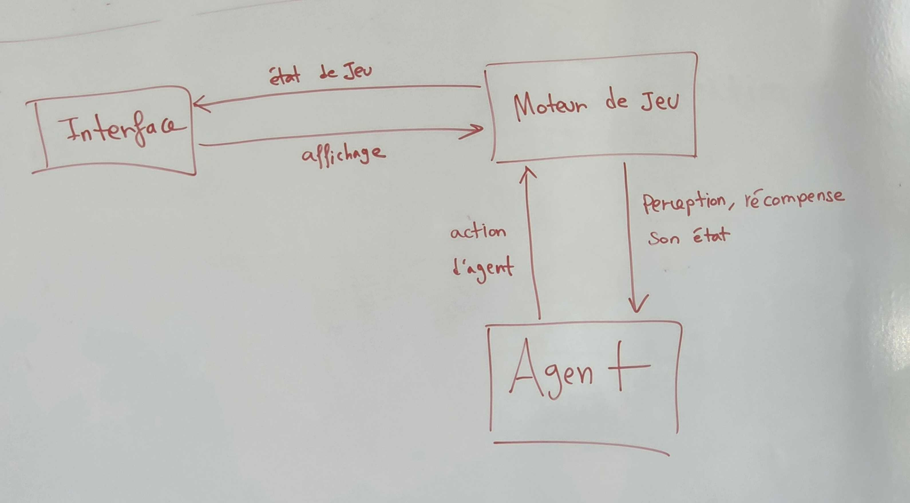
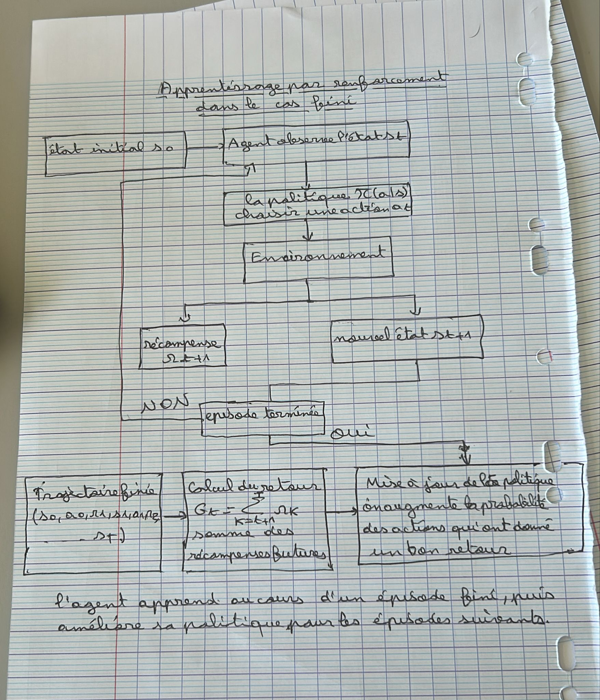
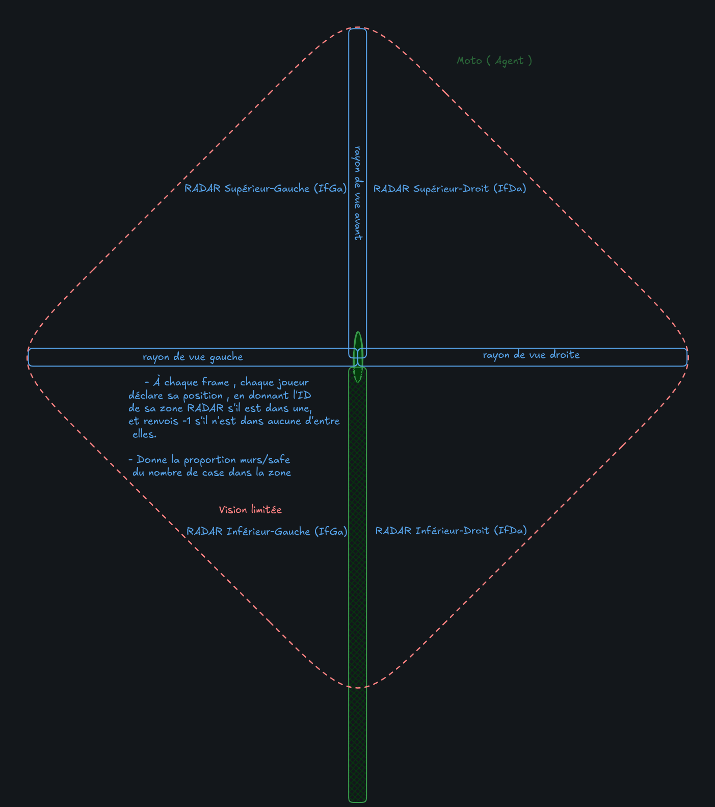
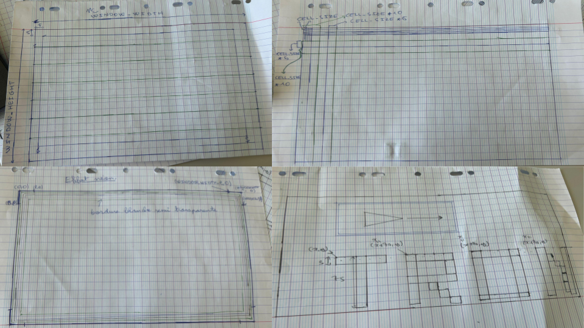
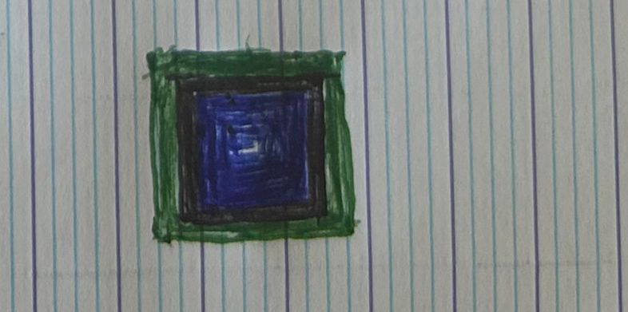

# Journal de bord du projet 2026

# Aprentissage automatique : REINFORCE sur le jeu de TRONZZ

  ## Contexte
  Ce journal de bord retrace l’avancement de notre projet TronZZ, qui consiste à développer un jeu de motos lumineuses en C/SDL2, en passant d’une intelligence artificielle réactive à une version améliorée utilisant l’apprentissage par renforcement avec REINFORCE. 

  ## Objectifs

  
* Comprendre le principe de l’apprentissage par renforcement.
* Étudier la méthode REINFORCE et son fonctionnement.
* Appliquer la méthode REINFORCE à notre jeu TronZZ afin d’améliorer le comportement des agents.
* Comprendre le principe de la parallélisation dans un programme.
* Créer deux versions du projet : une version sans parallélisation et une version avec parallélisation.
* Mesurer les temps d’exécution des différentes parties du programme.
* Comparer les performances entre la version sans parallélisation et la version avec parallélisation.
* Analyser les résultats obtenus, les limites rencontrées et les pistes d’amélioration possibles.

  
 

  ## Suivi des travaux 

  ### Lundi 22 juin
  Tous le groupe a compris le principe du REINFORCE et on a commencé de l'implémenter. 
  #### Nabil 
  J'ai commencé par comprendre le principe général de l’apprentissage automatique, en particulier l’idée qu’un agent   peut améliorer son comportement à partir de ses expériences.J'ai ensuite réfléchi à plusieurs façons d’appliquer cette idée à notre jeu TronZZ, notamment en utilisant les actions, les récompenses et les trajectoires des agents. Cette réflexion a permis de préparer les premières idées pour intégrer l’apprentissage par renforcement dans le projet.

  #### Gahui 
  -Initialisation automatique d’une nouvelle partie lorsque la précédente est terminée ; 

 -Reprogrammation du calcul de la perception en l’adaptant à la nouvelle structure de perception (avec le schéma de perception amélioré ci-dessous) :
 

 -Ajout de nouvelles fonctions permettant de déterminer l’état de la partie (victoire, etc.). 

  #### Issam

  ### Mardi 23 juin
  On a fini l'écriture du code du REINFORCE, on a corrigé des erreurs de compilation et on a lancé le trainage dans le soir.
 #### gahui Ban 
  -Réflexion sur le système de récompense et son implémentation en fonction des actions de l’agent et de leurs conséquences ; 
  

  -Séparation des modes « jeu » (avec l’utilisateur) et « entraînement » (sans utilisateur) afin de permettre un apprentissage par renforcement en arrière-plan ; 

  -Restructuration de la perception de l’agent et amélioration de l’algorithme pour tirer parti de cette nouvelle structure ; 

  -Recherche d’informations complémentaires sur l’apprentissage parallèle afin de mieux comprendre cette approche et de préparer son implémentation;
  #### Nabil
  J'ai intégré le principe de l’effet néon dans l’interface graphique du jeu afin de donner un style plus proche de l’univers Tron. J'ai également ajouté un écran d’entrée permettant de démarrer la partie avec la touche **Espace** ou **Entrée**. Enfin, J'ai mis en place un écran de fin qui affiche le résultat de la partie avec un message **WIN** ou **LOSE**.J'ai également amélioré l’affichage des cellules pleines en ajoutant deux couches de lueur autour de chaque cellule ainsi qu’un point blanc au centre.

  

  ### Mecredi 25 juin

  ##### gahui Ban
  -Correction de plusieurs problèmes algorithmiques dans le moteur de jeu afin d’assurer son bon fonctionnement. 

  -Poursuite des recherches sur l’apprentissage avec parallélisme pour mieux comprendre son fonctionnement et préparer son implémentation. 

  -Découverte et apprentissage de l’utilisation de la bibliothèque thread.h en langage C. 

  -Amélioration de l’initialisation des parties dans le moteur de jeu afin d’éviter les collisions entre les positions initiales des différents threads. 

  -Difficultés : 

Identification et correction des erreurs algorithmiques affectant le comportement du moteur de jeu. 

Compréhension des mécanismes de parallélisme et de synchronisation entre les threads ;

Gestion de l’initialisation simultanée des agents sans provoquer de conflits de position ; 

Problème de parallélisme sur la fonction “rand” : résolu en créant une version utilisant une graine locale pour chaque thread  ; 

 