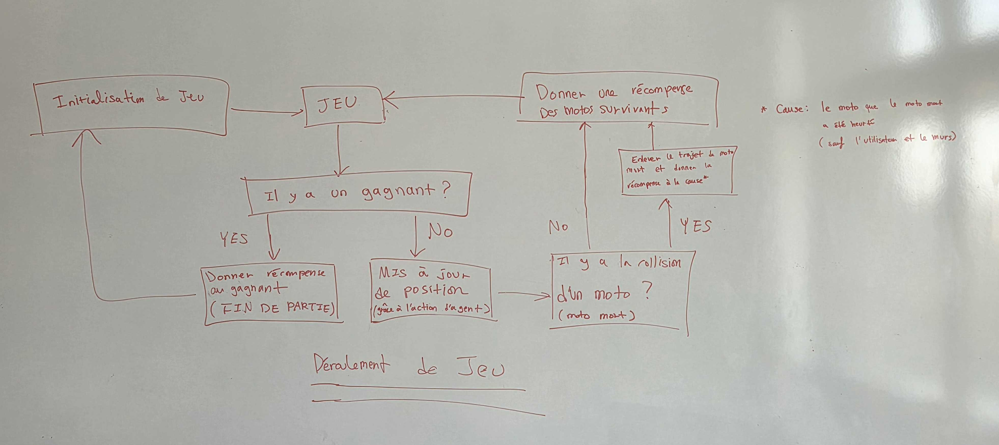
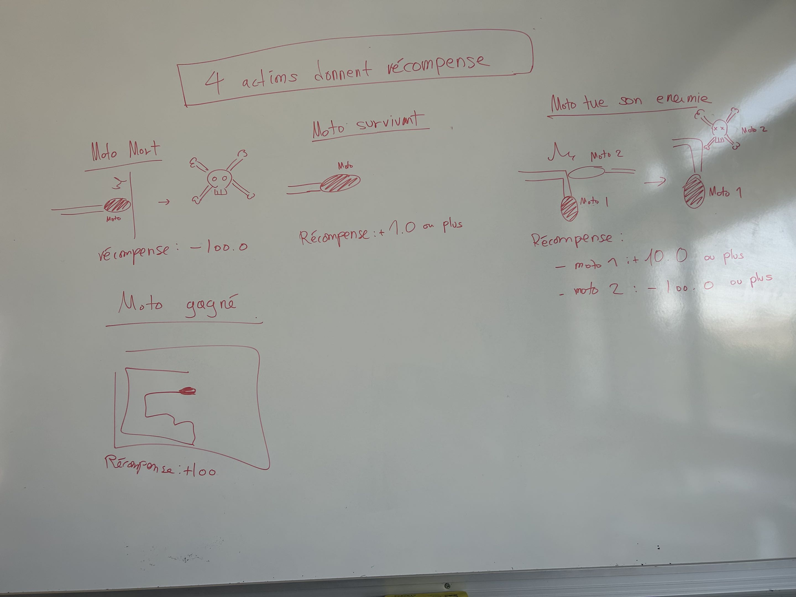
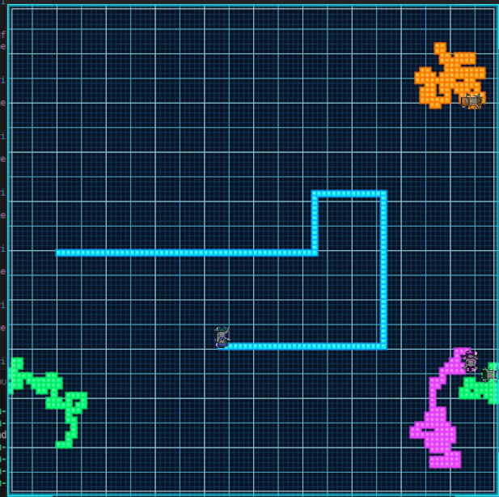
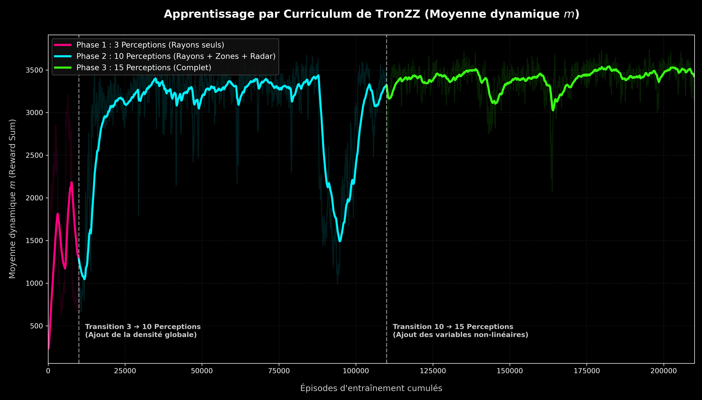
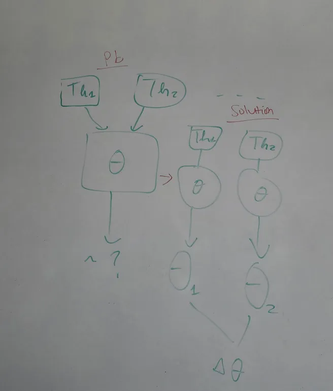

# Journal de bord du projet 2026

# Aprentissage automatique : REINFORCE sur le jeu de TRONZZ

  ## Contexte
  Ce journal de bord retrace l’avancement de notre projet TronZZ, qui consiste à développer un jeu de motos lumineuses en C/SDL2, en passant d’une intelligence artificielle réactive à une version améliorée utilisant l’apprentissage par renforcement avec REINFORCE. 

  ## Objectifs

* Comprendre le principe de l’apprentissage par renforcement.
* Étudier la méthode REINFORCE et son fonctionnement.
* Appliquer la méthode REINFORCE à notre jeu TronZZ afin d’améliorer le comportement des agents.
* Comprendre le principe de la parallélisation dans un programme.
* Créer deux versions du projet : une version sans parallélisation et une version avec parallélisation.
* Mesurer les temps d’exécution des différentes parties du programme.
* Comparer les performances entre la version sans parallélisation et la version avec parallélisation.
* Analyser les résultats obtenus, les limites rencontrées et les pistes d’amélioration possibles.

  
 

  ## Suivi des travaux 

  ### Conception Théorique & Système de Perception (Lundi 22 Juin)
*   **Réalisations du groupe :**
    *   **Modélisation théorique :** Établissement du formalisme de l'apprentissage stochastique par politique de gradient (REINFORCE) développé nativement en C. Les entrées d'état $s$ sont projetées via un vecteur de caractéristiques $\Phi(s)$ vers une politique de probabilités d'actions $\pi(a|s)$ via une fonction de sélection Softmax :
        $$Z_j = \sum_{i} \Phi(s)_i \cdot \theta_{i,j}$$
        $$\pi_j = \frac{e^{Z_j}}{\sum_{k} e^{Z_k}}$$
        Les gradients d'erreur de politique sont rétropropagés en fin d'épisode pour chaque étape temporelle $t$ en fonction du retour cumulé actualisé $G_t$ ($\gamma = 0.99$) :
        $$\theta_{i,j} \leftarrow \theta_{i,j} + \alpha \cdot \Phi(s)_i \cdot (y_j - \pi_j) \cdot G_t$$
    *   **Amélioration de Système de perception local :** dans la Conception d'un système de capteurs embarqués (lancers de rayons directionnels locaux) simulant la vision linéaire des agents à 180 degrés sans connaissance de la grille globale, l'ajout de connaissance de radar floue autour de l'agent . 
    *   **Amélioration de déroulement de jeu :** l'existence d'un gagnant(dernier survivant), initialisation de jeu, etc.
     
    *   **Amélioration de l'interface :** Effets de halo néon cyberpunk, écrans d'accueil et de fin (Victoire/Défaite).
  

  
  

### Implémentation du REINFORCE & Curriculum Learning (Mardi 23 Juin)
*   **Réalisations du groupe :**
    *   **Système de récompense :** Implémentation de la fonction de récompense globale (+1 point par frame de survie, -100 points en cas de collision, +50 points en cas d'élimination d'un concurrent). 
    *   **Séparation de mode de jeu :** le mode « jeu » (avec l’utilisateur) et « entraînement » (sans utilisateur) afin de permettre un apprentissage par renforcement en arrière-plan.
    *   **Curriculum Learning - Phase 1 (10 000 épisodes) :** Apprentissage initial restreint à 3 capteurs frontaux ($\Phi(s)$ à 3 dimensions). Ce bridage évite la divergence rapide et permet à l'IA d'apprendre les réflexes de survie primaires (évitement frontal des obstacles).
    *   **Analyse de comportement (Le minimum local de « l'escargot ») :** Sans perception globale ou de zone, l'IA a tendance à converger vers une stratégie pacifiste consistant à s'enrouler sur elle-même (spirale serrée) pour maximiser sa survie dans un coin libre de l'arène. La survie moyenne a triplé (de 60 à ~1300 frames) avec une action linéaire dominante vers l'avant (95%).
    *   **L’amélioration d’interface :** l’ajout d'un écran d’entrée permettant de démarrer la partie avec la touche Espace ou Entrée.
*   **Rendu visuel :**
  
    *   **le jeu sans l'apprentissage par renforcement**   
    *   **le jeu avec l'apprentissage par renforcement**
### Déboguage, Résolution des Divergences et Parallélisation (Mercredi 24 Juin)
*   **Réalisations du groupe :**
    *   **Curriculum Learning - Phase 2 (100 000 épisodes) :** Extension de la perception à 10 variables (3 rayons directionnels + 4 zones de radar de détection + 3 densités locales d'obstacles). 
    *   **Résolution des anomalies mathématiques (Explosion du Gradient) :**
        *   *Bug de mémoire non-initialisée :* Découverte d'une faille dans l'initialisation de la structure de perception qui polluait le gradient d'apprentissage avec des valeurs mémoires résiduelles aberrantes, entraînant la divergence de la matrice de poids ($\theta$ remplie de `NaN` à l'épisode 67 000). Correction par une purge et initialisation stricte des variables de perception.
        *   *Réduction de variance :* Réduction du taux d'apprentissage $\alpha$ de $0.001$ à $0.0001$ pour stabiliser le comportement probabiliste à long terme.
        *   *Correction du radar :* Correction de la fonction d'assignation du radar de zone pour y inclure le joueur humain et en filtrer l'auto-collision de l'agent (qui scannait sa propre traînée).
    *   **Curriculum Learning - Phase 3 (100 000 épisodes) :** Transition vers 15 variables (activation du croisement non linéaire de capteurs) pour permettre le traitement de scénarios complexes de type couloir ou entonnoir.
    *   **Analyse de convergence et d'exploration :** La survie moyenne s'est stabilisée à près de 1700 frames, atteignant régulièrement la limite maximale (timeout de 2000 frames). Observation d'un creux temporaire d'exploration aux alentours de l'épisode 90 000, illustrant l'autorégulation stochastique de la politique Softmax face à des tests de stratégies alternatives négatives avant de revenir à la convergence. 
    *   **Sécurisation mémoire et qualité du code :**
        *   *Résolution de Stack Overflow :* Migration de la structure d'historique de frames (`EpisodeMemoire`) d'une allocation sur la pile (4 Mo, causant des plantages mémoire) vers une allocation dynamique sur le tas (`calloc`).
        *   *Correction d'accès hors-limites :* Sécurisation des accès mémoires de frame (indices négatifs en cas de mort précoce du joueur).
        *   *Intégration d'outils d'analyse dynamique :* Validation avec les compilateurs de Sanitizers (ASan, UBSan) et profilage sous Valgrind garantissant un moteur robuste à fuite mémoire nulle.

### Mettre en pratique le parallélisme et comparaison de résultat puis préparation de soutenance (Jeudi 25 juin )
*   **Réalisations du groupe :**

    *  **Mise en pratique du parallélisme** ;
    * **Résolution d’un problème lié à l’initialisation du jeu lors de l’exécution parallèle:** Le conflit provenait du partage d’un espace global entre les threads. Une solution a été mise en place en utilisant une graine aléatoire locale à chaque thread afin d’éviter les interférences ;
    *   **Comparaison des temps d’exécution entre les versions parallélisée et non parallélisée du jeu**
    *   **Préparation de la soutenance :** réalisation des diapositives, création des schémas et élaboration du support de présentation ;

 

 